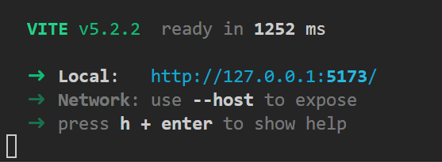

# Ludum Dare 55 - Summoning

# Development Environment

* Install VSCode - https://code.visualstudio.com/download
    * Get the Zig extension for VSCode
* Install Bun - https://bun.sh/
* Update your Environment PATH
    * Find the path to Zig from your VSCode User Settings JSON file and add the Zig's parent folder to the PATH
    * Bun path should have been updated automatically, can double check


# Running the Game

From the command line:
```
zig build wasm
bun run dev
```
> You should be able to ctrl+click the link to open up the URL to the game!



# Architecture

* Zig in the backend running the game state machine, passes concrete data about the current state of the game to the front-end to display.
* React frontend reads in state data and displays to user, passes back input events from the user to the backend game state machine to update.

# Game Design
* 4 Machines are working on a summoning
* Machines break down and you have to fix them
* If too many machines break down then the stage resets (4 stages of increasing difficulty)

# TODO

### Nathan
#### Saturday
* Actually implement EaselJS format
* Timed animations displaying
* Character controller - up down left right animations and x,y movement - work for controller and keyboard
#### Sunday
* Machines break down
* Character interaction with machines, A button, space bar,  play the interaction animation, machine is fixed (new graphic)
* Summoning animation (win) -> next stage reset
* Losing animation - text says "TOO BROKEN" -> current stage reset
* Win -> pause -> text says "SUMMONING COMPLETE"
#### Stretch Goals
* Obstacles - goo, electricity, ??? Something to slow you down while trying to get to the broken machine
* Main Menu, menu transitions

### Oscar
* Background (1080p 16:9)
* Summoning Chamber progess animation
* Summoning Chamber win animation
* Summoning Chamber fail animation
* Ghost (4 directions, idle animations, fixing animation (just one direction, we'll flip in runtime))
* Victory body animation
* Machine (4x) working idle animation
* Machine broken (animation?)
#### Stretch Goals
* Machine breakdown effect
* Fix effect
* Source Music and Audio